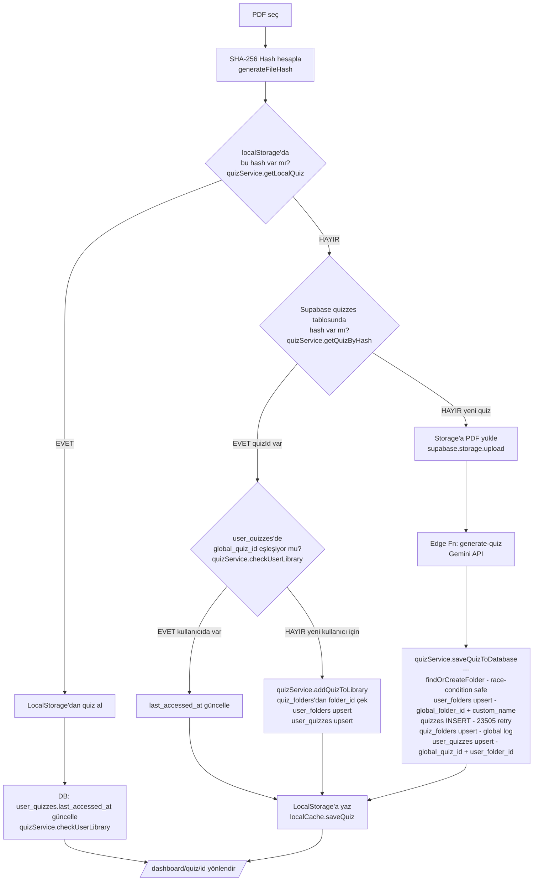

# QuizFlow Web — PDF → Quiz Akışı (Altın Kural)

Bu dosya, uygulamanın çekirdeğini oluşturan PDF yükleme ve quiz oluşturma akışını tanımlar.
**Bu akış gelecekte yapılacak tüm değişikliklerde referans alınmalı ve bozulmamalıdır.**

---

## Akış Diyagramı

---

## Kritik Kurallar

1. **`user_quizzes.global_quiz_id`** — FK `quizzes.id`'ye bağlı. `quiz_id` değil.
2. **`user_quizzes.user_folder_id`** — FK `user_folders.id`'ye bağlı. Doğrudan `folders.id` değil.
3. **`user_folders.global_folder_id`** — FK `folders.id`'ye bağlı.
4. **LocalStorage** her başarılı sonuçta yazılmalıdır (`localCache.saveQuiz`).
5. **Race condition koruması:** `quizzes` insert 23505 hatası alırsa retry ile mevcut ID alınır.
6. **Kütüphane kontrolü:** Quiz global DB'de var ama kullanıcıda yoksa `addQuizToLibrary` çağrılır. Yeniden generate edilmez.

---

## İlgili Dosyalar

| Dosya | Rol |
|---|---|
| `lib/quizService.ts` | Tüm DB + cache işlemleri |
| `components/features/dashboard/QuizUpload.tsx` | UI + akış orkestrasyonu |
| `utils/supabase/schema_migration.sql` | DB migration |
| `utils/supabase/v_user_library.sql` | Library view |
| `supabase/functions/generate-quiz/index.ts` | AI quiz generation (Edge Function) |
